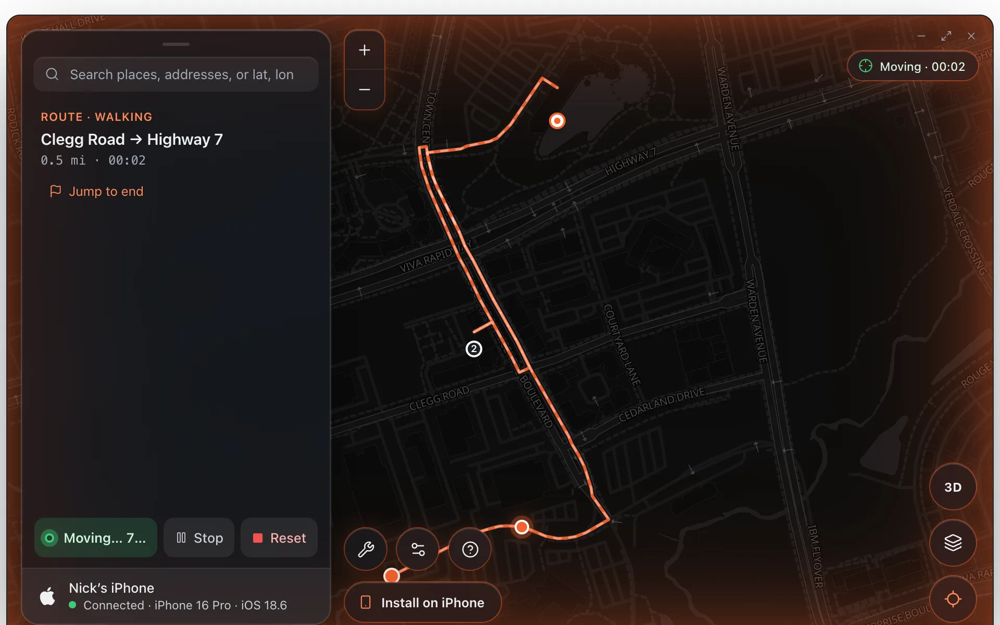
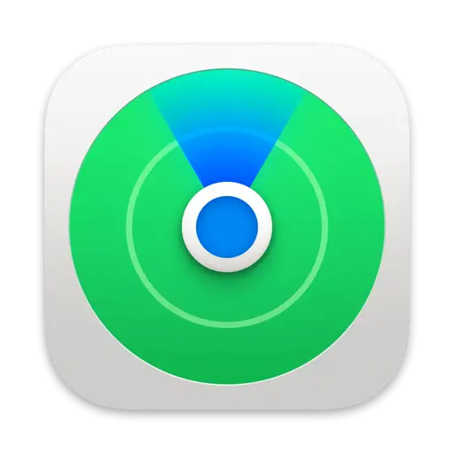
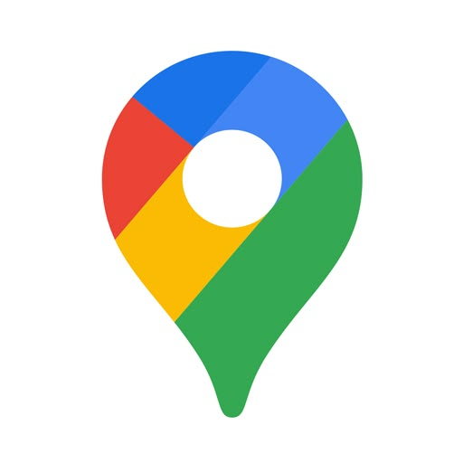
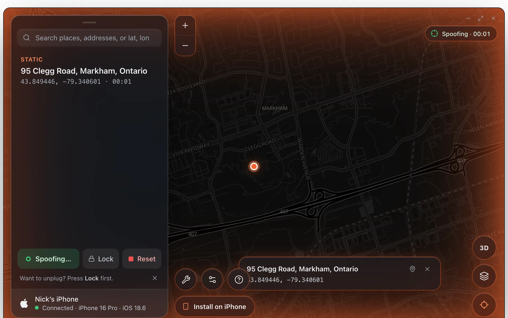
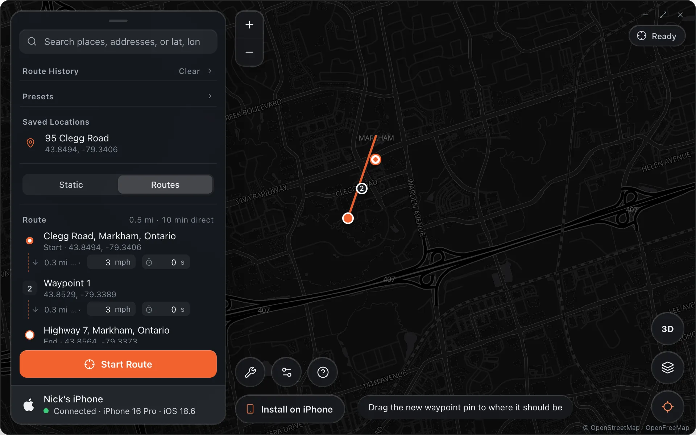
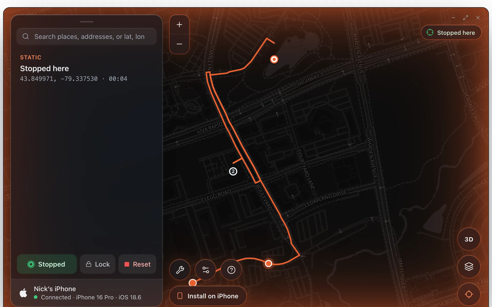
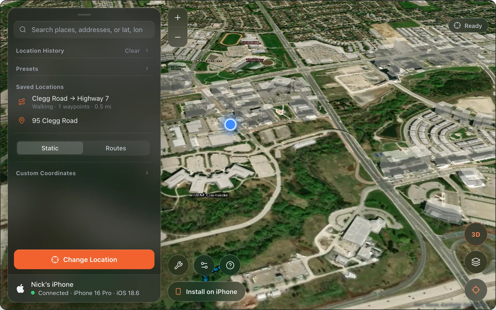
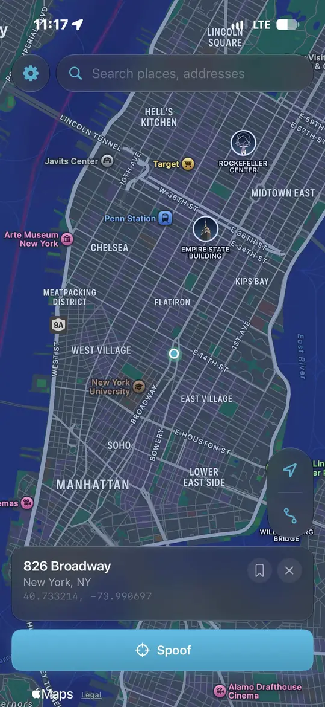
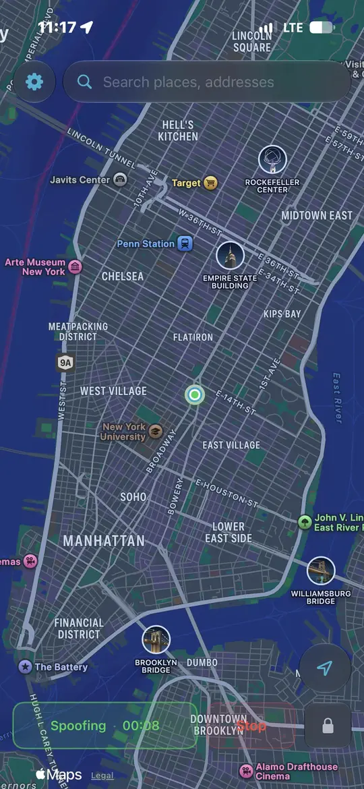

  

<h1 align="center">Alibi</h1>

  Put your iPhone anywhere on Earth from your Mac. Every app believes it. 
  <a href="https://nickkk66.github.io/alibi/"><b>Website</b></a> ·
  <a href="https://nickkk66.github.io/alibi/docs/"><b>Docs</b></a> ·
  <a href="https://github.com/Nickkk66/alibi/releases/latest/download/Alibi.dmg"><b>Download for Mac</b></a>

  
  
  
  

  

Alibi uses the location path Apple ships for developers, over a USB cable. Nothing on the phone is modified, nothing is jailbroken, and **Reset** puts real GPS back instantly. It works with every app that reads the phone's location: Find My, Maps, Life360, Snapchat, Instagram, Tinder, Pokémon GO and the rest.

  &nbsp;
  &nbsp;
  &nbsp;
  &nbsp;
  &nbsp;
  &nbsp;
  &nbsp;
  &nbsp;
  &nbsp;
  &nbsp;
  

## What it does

| | |
|---|---|
|  | **Static.** Search a place, click the map or paste coordinates, press **Change Location**. Pick another place while it holds and Alibi asks *Move here?*. **Lock** keeps the location after you unplug. |
|  | **Routes.** Numbered stops you can drag into order, up to ten waypoints, freehand drawing fitted to the roads, Walk / Cycle / Drive or **Auto** (each road's posted limit, lane changes on fast roads, pauses at corners). Preview the drive with a ghost marker before the phone moves. |
|  | **Stop, Continue, Back.** Stop holds the phone where it is and keeps the rest of the route for **Continue**. **Back** returns to the planner with the phone staying put, so the next leg can start from here. |
|  | **Maps.** Dark, Satellite with 3D buildings, Matrix and Light. Find My-style dots that scale with the zoom, a blue dot for where you really are, an animated route line. |

More in the docs: [Setup iPhone](https://nickkk66.github.io/alibi/docs/setup-iphone/) · [Static Mode](https://nickkk66.github.io/alibi/docs/static-mode/) · [Routes Mode](https://nickkk66.github.io/alibi/docs/routes-mode/) · [Saved Locations](https://nickkk66.github.io/alibi/docs/bookmarks/) · [FAQ](https://nickkk66.github.io/alibi/docs/faq/)

## Alibi Mobile

  &nbsp;&nbsp;
  

Install it once from the Mac with any Apple ID (**Install on iPhone**) and the phone changes its own location with no cable and no Mac around. It talks to itself through a loopback VPN, fetches the developer image on its own, and keeps working until the signature expires: a free Apple ID needs a re-sign every 7 days, which is one plug-in. [How it works and how to set it up.](https://nickkk66.github.io/alibi/docs/alibi-mobile/)

## Getting started

1. [Download Alibi for Mac](https://github.com/Nickkk66/alibi/releases/latest/download/Alibi.dmg), drag it to Applications and open it.
2. Plug the iPhone in with a data cable, unlock it and tap **Trust**. Turn on **Developer Mode** (Settings › Privacy & Security) and let the phone restart. **Setup** in the app walks through it.
3. Enter your access code. One code covers one Mac and one iPhone.
4. Pick a place and press **Change Location**.

Access codes are time-limited, checked against Alibi's licence server and bound to the devices that use them, so they cannot be shared or forged. Every licence can invite three friends for three weeks each. [Get a code on the website.](https://nickkk66.github.io/alibi/#pricing)

## This repository

The website under `site/` (plain HTML, CSS and JavaScript, published to GitHub Pages on every push) and the release builds: `Alibi.dmg` for the Mac and `AlibiMobile.ipa` for the phone. The app source is not published here.

## Reporting a problem

[Open an issue](https://github.com/Nickkk66/alibi/issues) with the text from Settings › Phone › **Copy diagnostics**. It holds the phone's state and the last fifty log lines, nothing personal.
